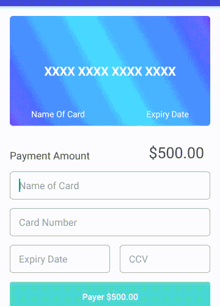
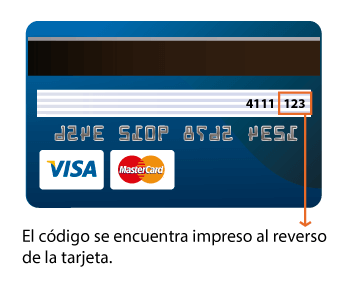

# Validador de tarjeta de crédito

* **Colaboradoras** _Claudia Trujillo, Sandra Pantoja_
* **Curso:** _JS Deep Dive: Crea tu propia librería usando JavaScript_
* **Unidad:** _Sprint 4_
* **Desarrollado para: Laboratoria [http://laboratoria.la]


***

El validador de datos de tarjeta de crédito proporciona utilidades de validación para las entradas de datos de la tarjeta de crédito. Está diseñado como un módulo CommonJS para usar en Node.js, o el navegador. Presenta una interfaz de usuario adecuada al mismo.

Notifica al usuario si los datos que ingresan no son válidos.

El plugin debe recibir una referencia a un elemento del DOM que contenga
`<input>`s con los siguientes nombres (atributo `name`):

* `name`: Nombre completo como aparece en la tarjeta
* `cn` (Card Number): El número de la tarjeta de crédito
* `exp` (Expiry Date): Fecha de expiración
* `cvv` (Card Verification Value): Código de validación de 3 dígitos


Durante el proceso de validación, si los datos de la tarjeta son válidas el navegador mostrará mensaje **_"Tarjeta válida"_** a los datos que no pasen la validación, lanzará el mensaje **_"Tarjeta inválida"_**.
El validador sólo acepta tarjetas Visa y Master Card; **Visa**, empiezan con número **4** y **MasterCard**, empieza con **5**.

## Instrucciones

1. Ingresa tu nombre completo tal como aparece en tu tarjeta de crédito. 
    >⋅⋅1. Acepta mayúsculas y minúsculas y espacios entre nombres.
    >⋅⋅2. No acepta números ni caracteres especiales.
2. Ingresa el número de tarjeta de crédito, deberás verificar que 
  >⋅⋅1. Ingreses exactamente dieciséis dígitos.
   ⋅⋅2. Que no ingreses letras.
   ⋅⋅3. Que no ingreses espacios ni caracteres especiales.
3. Ingresa la fecha de expiración de tu tarjeta de crédito. La fecha de vencimiento está impresa o grabada a     relieve.
    >⋅⋅1. La primer casilla corresponde a la verificación de los meses del año, acepta que se ingresen solo dos dígitos del **_"01"_** al **_"12"_**, no acepta letras, caracteres especiales ni espacios.
    >⋅⋅2. La segunda casilla corresponde a la verificación de los últimos dos dígitos del año de expiración, acepta número del **_15_** al **_23_**, no acepta que se ingresen letras, caracteres especiales ni espacios.
4. El código de verificación deben ser tres dígitos, cuidando no ingresar letras, caracteres especiales ni     espacios.Los dígitos verificadores o CVV, contemplan estos 3 números impresos en un recuadro blanco al     lado derecho del panel de firma o en el panel mismo.
5. En este punto si aparece en tu navegador el mensaje **_"Tarjeta válida"_** (corroborado con el             algoritmo de luhn) estás lista para realizar tu transacción; haz click en **_pagar_**.

## Demo



## Instalar librería

```npm install credit-card-validator```

## Ejemplo

```html
<form>
      <hr>
        <div class="form-group">
          <label for="cn">Número de tarjeta</label>
          <input id="cn" name="cn"/>
          
        </div>
        <div class="form-group">
          <label for="exp">Fecha de vencimiento</label>
          <div class="date">
            <div> <input id="expMonth" name="exp" placeholder="month"/></div>
            <div><span>/</span></div>
          <div> 
            <input id="expYear" name="exp" placeholder="year"/></div>
        </div>
        </div>
        <div class="form-group">
          <label for="cvv">CVV</label>
          <input id="cvv" name="cvv" />
          
        </div>
        <div class="form-group">
          <label for="name">Nombre completo</label>
          <input id="name" name="name" />
        </div>        
        <hr> 
        <input id = "button" type="submit" value="Pagar" />
        <center><span class="foot" >Desarrollado por</span> </center>         
      </form>
```

```js
const validateAllTDC = (name, num, month, year, cvv, dataClients) => {
    compareFunctions.sentData(dataClients);

    if (validateFunctions.validateName(name) && validateFunctions.validateNumTDC(num) && validateFunctions.expDateMonth(month) && validateFunctions.expDateYear(year) && validateFunctions.cvvVal(cvv)) {
        // console.log("Tarjeta si valida");
    } if (compareFunctions.compareUserName(name) && compareFunctions.compareUserNumTDC(num) && compareFunctions.compareMonth(month) && compareFunctions.compareYear(year) && compareFunctions.compareUserCvv(cvv)) {
        console.log("Tarjeta valida para pagar");
        return true;
    }
    console.log("TARJETA NO VALIDA");
    return false;
};
```

A la hora de hacer las validaciones, la librería debería de lanzar un alert:
`TARJETA RECHAZADA. El pago no pudo ser realizado. /t Favor de verificar tus datos de ingreso` cuando los `<input>` no pasen la validación, o el alert `PAGO EXITOSO`
en caso de que sí pase.
